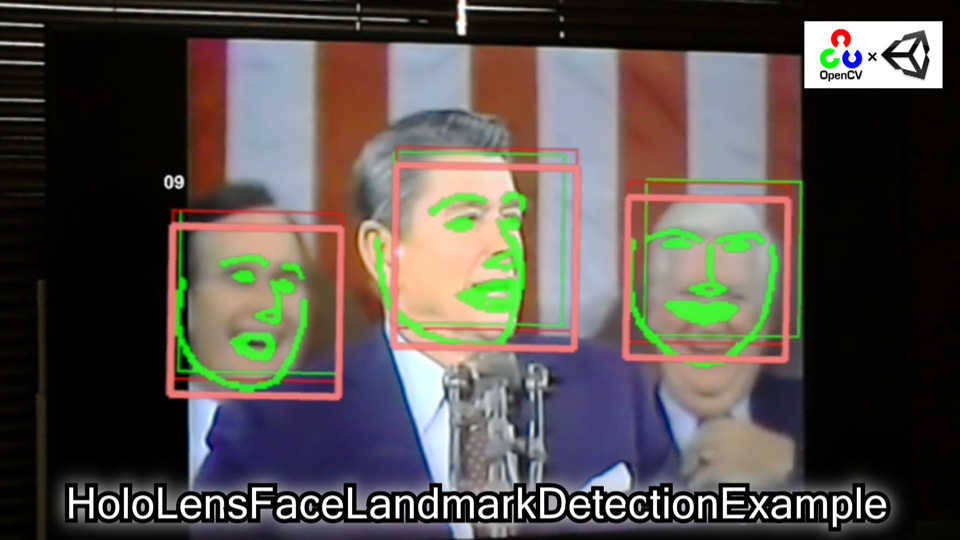
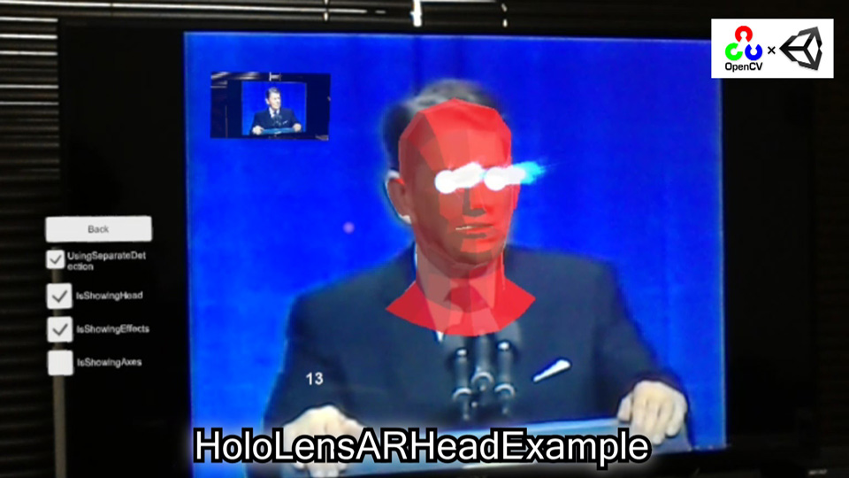

HoloLens With DlibFaceLandmarkDetector Example
====================

Note
=====
*When starting the scene, keep in mind that the scene seems to stop for dozens of seconds to initialize the face landmark detector.*

Demo Video
-----

Environment
-----
Windows 10  
Unity 5.6.1f1  
HoloToolKit v1.5.7.0  ([https://github.com/Microsoft/HoloToolkit-Unity/releases](https://github.com/Microsoft/HoloToolkit-Unity/releases))  
OpenCV for Unity 2.2.0 ([https://www.assetstore.unity3d.com/en/#!/content/21088](https://www.assetstore.unity3d.com/en/#!/content/21088))  
Dlib FaceLandmarkDetector 1.1.0 ([https://www.assetstore.unity3d.com/en/#!/content/64314](https://www.assetstore.unity3d.com/en/#!/content/64314))  

Setup
-----
* Create a new project. (HoloLensWithDlibFaceLandmarkDetectorExample)
* Import the HoloToolKit-Unity-v1.5.7.0.unitypackage.
* Setup the HoloToolKit. (HoloToolKit > Configure > Apply HoloLens Project Setting)
* Import the OpenCVForUnity.
* Import the DlibFaceLandmarkDetector.
* Import the HoloLensWithDlibFaceLandmarkDetectorExample.unitypackage.
* Add the "Assets/HoloLensWithDlibFaceLandmarkDetectorExample/*.unity" files to the "Scenes In Build" list in the "Build Settings" window.
* Add the "WebCam" to "Publishing Settings > Capabilities" checklist in the "Player Settings" window.
* Build and Deploy. (See [https://developer.microsoft.com/en-us/windows/holographic/holograms_100](https://developer.microsoft.com/en-us/windows/holographic/holograms_100))

ScreenShot
-----
 

 

 

