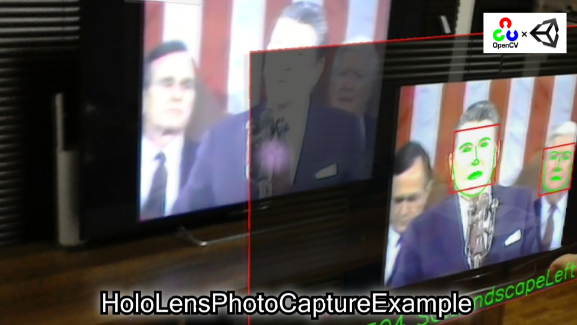

# HoloLens With DlibFaceLandmarkDetector Example

## What's new
By using the "HoloLensCameraStream" asset, video capture can now be executed faster.

## Note
**When starting the scene, keep in mind that the scene seems to stop for dozens of seconds to initialize the face landmark detector.**

## Demo Video (old version)

## Environment
* Windows 10 Pro 1709  
* Windows 10 SDK 10.0.14393.0 to 10.0.16299.0  
* Visual Studio 2017 (v151.5.0)  
* Unity 2017.1.3f1  
* HoloToolkit-Unity-v1.2017.1.2 ([https://github.com/Microsoft/MixedRealityToolkit-Unity/releases](https://github.com/Microsoft/MixedRealityToolkit-Unity/releases))  
* OpenCV for Unity 2.2.6 ([https://assetstore.unity.com/packages/tools/integration/opencv-for-unity-21088](https://assetstore.unity.com/packages/tools/integration/opencv-for-unity-21088))  
* Dlib FaceLandmarkDetector 1.1.9 ([https://assetstore.unity.com/packages/tools/integration/dlib-facelandmark-detector-64314](https://assetstore.unity.com/packages/tools/integration/dlib-facelandmark-detector-64314))  
* HoloLensCameraStream ([https://github.com/VulcanTechnologies/HoloLensCameraStream](https://github.com/VulcanTechnologies/HoloLensCameraStream))  

## Setup
1. Clone this repository.
1. Create a new project. (HoloLensWithDlibFaceLandmarkDetectorExample)
1. Import the HoloToolkit-Unity-v1.2017.1.2.unitypackage.
    * Setup the HoloToolKit. (Mixed Reality ToolKit > Configure > Apply Mixed Reality Project Setting)
1. Import the OpenCVForUnity.
    * Setup the OpenCVForUnity. (Tools > OpenCV for Unity > Set Plugn Inport Settings)
1. Import the DlibFaceLandmarkDetector.
    * Setup the OpenCVForUnity. (Tools > Dlib FaceLandmarkDetector > Set Plugn Inport Settings)
    * Move the "DlibFaceLandmarkDetector/StreamingAssets/sp_human_face_68.dat" and "DlibFaceLandmarkDetector/StreamingAssets/sp_human_face_68_for_mobile.dat" to the "Assets/StreamingAssets/" folder. 
1. Clone HoloLensCameraStream repository.
    * Copy the "HoloLensCameraStream/HoloLensVideoCaptureExample/Assets/CamStream/" folder to the "Assets/" folder.
1. Import the HoloLensWithDlibFaceLandmarkDetectorExample.unitypackage.
1. Add the "Assets/HoloLensWithDlibFaceLandmarkDetectorExample/*.unity" files to the "Scenes In Build" list in the "Build Settings" window.
1. Add the "WebCam" to "Publishing Settings > Capabilities" checklist in the "Player Settings" window.
1. Build and Deploy to HoloLens. (See [https://developer.microsoft.com/en-us/windows/holographic/holograms_100](https://developer.microsoft.com/en-us/windows/holographic/holograms_100))

|Assets|Buld Settings|
|---|---|
|||

## ScreenShot (old version)
 

 

 

